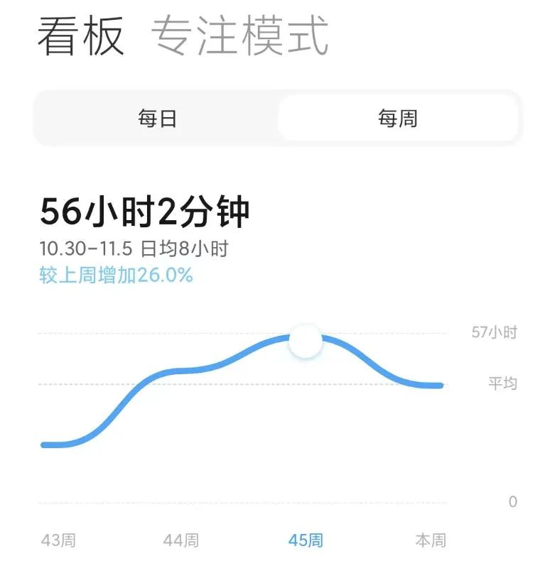
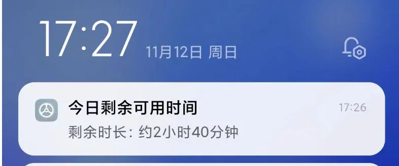

最近发现的手机使用时间有点过分长了，最近几周基本都在40多小时以上，45周更是夸张的达到了56小时，平均每天高达8小时。实际情况是每天并没有多少需要我实时去处理的消息，很多时候只是在不停的看消息水群、找一些无聊的游戏打发时间、冲浪看一些无关紧要的内容，手机成为了刻意消磨时间的工具。  

可能是现在有了更多的自由支配时间，突然多出来大量的时间没有规划，于是就继续了以前上班摸鱼下班娱乐的消耗时间模式。不过一些弊端也开始显现，长时间的使用手机除了让人觉得空虚以外，发现手机已经开始无意识地影响我的生活了。每当离开手机时仿佛有一个无形的力量在将你拉回手机屏幕，吸引你时不时就要拿起手机，然后大量的时间消磨在了手机的碎片和娱乐信息里。

​发现在使用电脑时，专注的办公、学习、整理知识变的容易很多，时间按照整块整块的就过去了，不得不说PC的生产效率依然远高于手机。相比于使用手机，PC消耗的整块时间是令人愉悦的。如此大量的手机使用时长，与其说是手机消耗了你的碎片时间，不如说是手机打碎了你的时间。

因此我决定开启计划改变这一现状，主要计划为：

- 每周的手机使用时间减少到28小时以内，在手机系统设置每日屏幕使用时间上限为4小时；
    
- 工作、学习主要用PC处理，手机端定时集中查看工作消息；
    
- 集中时间查看和处理消息碎片化的社群消息、知识文章等；
    
- 晚上分出整块的时间陪伴家人，期间禁止频繁的看手机行为；
    
- 优先阅读纸质书籍，告别电子屏幕。
    
    

手机使用时长的减少，理论上能够大幅带来生产力的提升，是否还会有其他主观感受的变化后续可以再写一写。

写完这篇文章的今天17:30，手机今日使用时长显示还有2小时40分钟。

